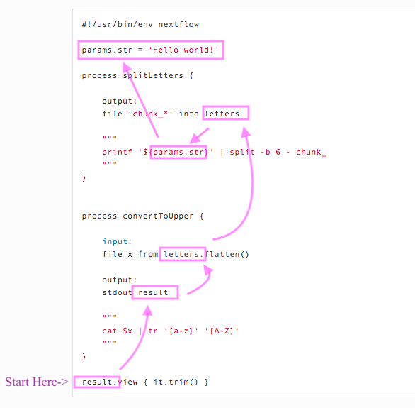

```{r setup, include=FALSE}
knitr::opts_chunk$set(
  echo = TRUE,
  collapse = TRUE,
  comment = "#>",
  fig.path = "imgs/nf_"
)
```

# Workflow tools

**Last Update:** 2020/08/03

**Purpose:** Describe workflow tools in terms of Makefiles, Snakemake, and Nextflow

Probably the earliest workflow tool is Makefiles for compiling large c++ projects. Because compilation can be long and tedious, it was important to keep track of which files had been compiled and needed to be recompiled. [The c++ compilation dependency graphs were put into a Makefile](https://www.tutorialspoint.com/makefile/makefile_dependencies.htm) and listed as rules.

```
rule: dependencies...
    echo "any bash command here, usually a g++ statement"
    
```

In case you're curious, here's a [nice tutorial on makefiles](https://makefiletutorial.com/).

[Snakemake](https://snakemake.readthedocs.io/en/stable/) workflows are python scripts extended to include rules (notice how the rules look like c++ Makefile rules). Snakemake is available on bioconda, pip, and docker.

[Nextflow](https://www.nextflow.io/example1.html) place those rules inside process structures. Nextflow is also supposed to be scalable (parallizable) and containerizes the dependencies.

# Citations

* Köster, J. and Rahmann, S., 2012. [Snakemake—a scalable bioinformatics workflow engine](https://pubmed.ncbi.nlm.nih.gov/22908215/). Bioinformatics, 28(19), pp.2520-2522.
* Di Tommaso, P., Chatzou, M., Floden, E.W., Barja, P.P., Palumbo, E. and Notredame, C., 2017. [Nextflow enables reproducible computational workflows](https://pubmed.ncbi.nlm.nih.gov/28398311/). Nature biotechnology, 35(4), pp.316-319.
* Federico, A., Karagiannis, T., Karri, K., Kishore, D., Koga, Y., Campbell, J. and Monti, S., 2019. [Pipeliner: A Nextflow-based framework for the definition of sequencing data processing pipelines](https://pubmed.ncbi.nlm.nih.gov/31316552/). Frontiers in genetics, 10, p.614.

## NextFlow

Click to expand the following items for more detail.

<details><summary>Install Nextflow on MacOS - <b>DONE</b></summary>

Based on [installation instructions on Nextflow](https://www.nextflow.io/), make sure Java version > 1.8

```
java -version
#> java version "1.8.0_162"
#> Java(TM) SE Runtime Environment (build 1.8.0_162-b12)
#> Java HotSpot(TM) 64-Bit Server VM (build 25.162-b12, mixed mode)
```

Install a local copy of nextflow

```
curl -s https://get.nextflow.io | bash
#> CAPSULE: Downloading dependency org.slf4j:log4j-over-slf4j:jar:1.7.25
#> CAPSULE: Downloading dependency org.multiverse:multiverse-core:jar:0.7.0
#> CAPSULE: Downloading dependency com.fasterxml.jackson.core:jackson-databind:jar:2.6.7.2
#> CAPSULE: Downloading dependency joda-time:joda-time:jar:2.8.1
#> ...
#> CAPSULE: Downloading dependency commons-codec:commons-codec:jar:1.10
#>                                                                         
#>       N E X T F L O W
#>       version 20.04.1 build 5335
#>       created 03-05-2020 19:37 UTC (14:37 CDT)
#>       cite doi:10.1038/nbt.3820
#>       http://nextflow.io
#> 
#> 
#> Nextflow installation completed. Please note:
#> - the executable file `nextflow` has been created in the folder: /Users/jenchang/bin/src
#> - you may complete the installation by moving it to a directory in your $PATH
#>

ls -ltr
#> -rwx--x--x  1 jenchang  staff    15K Jul 15 13:22 nextflow
```

The executable `nextflow` can be called locally or moved to the `/usr/local/bin/` folder to be called from anywhere.

</details>

<details><summary>Install Nextflow on Ceres HPCC - <b>worked when I tried it</b></summary>

After logging onto Ceres, load the java module and run the nextflow install script

```{bash, eval=FALSE}
module load java
java -version 

# Install Nextflow in current folder
curl -s https://get.nextflow.io | bash

# Test the nextflow install by running it
./nextflow run hello
```

</details>


<details> <summary>Simple demo - <b>DONE</b></summary>

The simple example from [nextflow main page](https://www.nextflow.io/) worked.

```
nextflow run hello
#> N E X T F L O W  ~  version 20.04.1
#> Pulling nextflow-io/hello ...
#> downloaded from https://github.com/nextflow-io/hello.git
#> Launching `nextflow-io/hello` [adoring_yonath] - revision: 96eb04d6a4 [master]
#> executor >  local (4)
#> [f0/2e6b0f] process > sayHello (3) [100%] 4 of 4 ✔
#> Ciao world!
#> 
#> Hola world!
#> 
#> Bonjour world!
#> 
#> Hello world!
```

</details>


<details><summary>Your first script - <b>DONE</b></summary>

Ran the [Tutorial "your first script"](https://www.nextflow.io/docs/latest/getstarted.html#your-first-script). Save the following into a file `tutorial.nf`. Notice how nextflow scripts have the `.nf` extension. Also notice the shebang of the script is not `bash` or `python` but `nextflow`.

```
#!/usr/bin/env nextflow

params.str = 'Hello world!'

process splitLetters {

    output:
    file 'chunk_*' into letters

    """
    printf '${params.str}' | split -b 6 - chunk_
    """
}


process convertToUpper {

    input:
    file x from letters.flatten()

    output:
    stdout result

    """
    cat $x | tr '[a-z]' '[A-Z]'
    """
}

result.view { it.trim() }
```

Running the nf script results in :

```
nextflow run tutorial.nf 
#> N E X T F L O W  ~  version 20.04.1
#> Launching `tutorial.nf` [confident_hilbert] - revision: be42f295f4
#> executor >  local (3)
#> [e7/25735b] process > splitLetters       [100%] 1 of 1 ✔
#> [c5/fe3e83] process > convertToUpper (1) [100%] 2 of 2 ✔
#> WORLD!
#> HELLO
```

It might be a little confusing on how to read this script. Read from **bottom up**, I've annotated arrows for how my eyes move across the script.



Processes are executed up the dependency becaues `results` must be created for the output. 

Regardless, I'll need a better understanding of what `results.view {it.trim()}` is doing... and which data structures are available in the nextflow language. This doesn't look like standard bash.

</details>

> For Nextflow language basics, recommend starting at this [sphinx-generated documentation](https://www.nextflow.io/docs/latest/script.html#script-page)...notice that the language seems to wrap bash scripts in java functions. Honest reaction so far is that nextflow commands seem to be aimed at java programmers. Despite the shebang `#! /usr/bin/env` which usually indicates bash/python/other scripting-style languages, the function names (example: `println` instead of bash's `echo`) are from java. Nextflow feels like trying to "speak bash with a java accent". Not saying it's bad, but still exploring features on if the java-accent is worth it.

<details><summary>Nextflow basics: data structures - <b>DONE</b> </summary>

Let's start with a hello world... this thing needs to print, putting it into a process without generating a print statement/file doesn't prove it runs or even makes sense.

Let's make a basic "Hello world" **print** to console in **script01.nf**

```{bash, eval=FALSE, code=readLines("code/script01.nf")}
```

The **bash** run and output works.

```
nextflow run script01.nf
#> N E X T F L O W  ~  version 20.04.1
#> Launching `script01.nf` [gigantic_koch] - #> revision: 583e6071f6
#> Hello world!
```

Moving on to defining **basic variables** and printing them in **script02.nf**: integers, float/double, booleans, strings

```{bash, eval=FALSE, code=readLines("code/script02.nf")}
```

Which gives us in **bash**:

```
nextflow run script02.nf
#> N E X T F L O W  ~  version 20.04.1
#> Launching `script02.nf` [desperate_bell] - revision: 283effe268
#> 
#> #== Primitive data structures
#> x can equal: 
#> 1			    Integers
#> -3.1499392	            Float or double values
#> false		    Booleans
#> Hi			    Strings and characters
#> Thu Jul 23 10:56:34 CDT 2020	Or dates from java.util.Date()
```

Nextflow has **grouped data structures** that can have heterogeneous types... as a comparison c++ usually has homogeneous element collections (unless you hack it with smart pointers).

Demonstrate list, map and multi assignment in **script03.nf**:

```{bash, eval=FALSE, code=readLines("code/script03.nf")}
```

Output in bash:

```{bash, eval=FALSE}
nextflow run script03.nf

#> N E X T F L O W  ~  version 20.04.1
#> Launching `script03.nf` [kickass_shirley] - revision: 19bc7c56d2
#>
#> #== Grouped data structures: Lists, Maps
#> myList = [1776, -1, 33, 99, 0, 928734928763]
#> myList[0] = 1776     List index starts at 0
#> size = 6
#> tiny = [one, two]
#> myList = [1776, -1, [one, two], 99, a, 928734928763] List elements can be of mixed type! Similar to R's list
#>
#> myMap = [gene:FOX2, length:100, genbank:MX8888]
#> myMap = [gene:FOX2, length:ten, genbank:MX8888]
#>
#>  Multiple assignments (a, b, c) = ["one", 2, "three"]
#> a = one; b = 2; c = three
```

</details>

<details><summary>Nextflow execute bash/R/Python scripts via process - <b>DONE</b></summary>

A bash command is saved as a string and then `execute`-ed in **script04.nf**

```{bash, eval=FALSE, code=readLines("code/script04.nf")}
```

However notice how the string can only have one command as it prints out the next `echo` in the **bash** output, instead of executing it. 

```{bash, eval=FALSE}
nextflow run script04.nf
#> N E X T F L O W  ~  version 20.04.1
#> Launching `script04.nf` [romantic_jones] - revision: 4536b402c2
#> "Hello world"
#> 
#> "Hello again"; echo "what is happening, why print echo" " " /* threw an error on bash comments, so can't even use bash comments in a bash block */ /* so cmd strings cannot do multiline bash... weird */
```

This is fixed in the process structures, where multi-line commands seem to work.

Still called **script05.nf** but using process structures.

```{bash, eval=FALSE, code=readLines("code/script05.nf")}
```

Process 1 doesn't have an output specified, so prints nothing. Process 2 is connected to output `result2`. Process 3 is a bunch of R commands, basically need the shebang to specify the language.

```{bash, eval=FALSE}
nextflow run script05.nf
#> Notice how above has no output
#> DataflowVariable(value=null)
#> DataflowVariable(value=null)
#> executor >  local (3)
#> [d0/e1cf69] process > myprocess1 [100%] 1 of 1 ✔
#> [58/f7a9bb] process > myprocess2 [100%] 1 of 1 ✔
#> [4b/847e83] process > myprocess3 [100%] 1 of 1 ✔
#> Process2 says hello
#> Still in Process 2
#> Rscript says Hello world
#> 1 2 3 4 5
```

</details>

<details><summary>Minimal example of a chain of processes - <b>DONE and neat : )</b></summary>

Instead of worrying about installing a long running program, we'll simulate it using the `sleep 5` command (wait 5 seconds).

```{bash, eval=FALSE, code=readLines("code/script06.nf")}
```

Which looks nice in bash... as it prints progress

```{bash, eval=FALSE}
N E X T F L O W  ~  version 20.04.1
Launching `code/script06.nf` [crazy_mclean] - revision: c6a509673f

Pipeline = Amy -> Bob -> Cathy -> Dave -> Eve
 where each person runs 5 seconds to pass the baton to next person

DataflowVariable(value=null)
executor >  local (2)
[ee/41b22c] process > Amy   [100%] 1 of 1 ✔
[cf/db02ae] process > Bob   [  0%] 0 of 1
[-        ] process > Cathy -
[-        ] process > Dave  -
[-        ] process > Eve   -
```

Eventually looks like the following when finished:

```{bash, eval=FALSE}
nextflow run code/script06.nf
N E X T F L O W  ~  version 20.04.1
Launching `code/script06.nf` [crazy_mclean] - revision: c6a509673f

Pipeline = Amy -> Bob -> Cathy -> Dave -> Eve
 where each person runs 5 seconds to pass the baton to next person

DataflowVariable(value=null)
executor >  local (5)
[ee/41b22c] process > Amy   [100%] 1 of 1 ✔
[cf/db02ae] process > Bob   [100%] 1 of 1 ✔
[b0/cccd94] process > Cathy [100%] 1 of 1 ✔
[9f/a652c6] process > Dave  [100%] 1 of 1 ✔
[ca/39a72a] process > Eve   [100%] 1 of 1 ✔
Amy passes baton
; Bob passes baton
; Cathy passes baton
; Dave passes baton
; Eve passes baton
```

</details>

<details><summary>Nextflow nf-core/RNAseq - <b>DONE</b>, okay I admit the HTML reports are neat</summary>

`nf-core` has a curated set of pipelines. We'll run the rnaseq pipeline ([github link](https://github.com/nf-core/rnaseq)). 

* Start Docker deamon on MacOS 
* Run the nf_core/rnaseq pipeline (will pull via docker)

```{bash, eval=FALSE, code=readLines("code/nf_core_rnaseq.output")}
```

This generates the following `results` folder, containing output folders

```{bash, eval=FALSE, code=readLines("code/nf_core_rnaseq.results")}
```

Inside of `pipeline_info` are html generated reports for runtime and more details of pipeline


<!---->

Okay, I admit that the html reports are nice. Looking at the source code, the whole pipeline is defined in [main.nf](https://github.com/nf-core/rnaseq/blob/master/main.nf)... if we focus on the **fastqc** step, we can see process:

```{bash, eval=FALSE}
/*
 * STEP 1 - FastQC
 */
process fastqc {
    tag "$name"
    label 'process_medium'
    publishDir "${params.outdir}/fastqc", mode: 'copy',
        saveAs: { filename -> filename.indexOf(".zip") > 0 ? "zips/$filename" : "$filename" }

    when:
    !params.skipQC && !params.skipFastQC

    input:
    set val(name), file(reads) from raw_reads_fastqc

    output:
    file "*_fastqc.{zip,html}" into fastqc_results

    script:
    """
    fastqc --quiet --threads $task.cpus $reads
    """
}

```

Notice the `publishDir "${params.outdir}/fastqc` declaration, the `${params.outdir}` was set to 'results' earlier in this script, so this is how we get a `results` directory. Each step of the pipeline can have its own process and could organize the output similar to `results/program_name`.

</details>

<details><summary>modules and writing files - <b>in progress</b></summary>

Let's create a process that creates an example fasta file. Notice how we need a `publishDir` in the process.

```{bash, eval=FALSE, code=readLines("code/mod_process07.nf")}
```

And include that process in a different nextflow script

```{bash, eval=FALSE, code=readLines("code/script07.nf")}
```

Running the script results in...

```{bash, eval=FALSE}
nextflow run script07.nf --outdir output_dir
#> N E X T F L O W  ~  version 20.07.1
#> Launching `script07.nf` [thirsty_dalembert] - revision: 997b0d2610
#> executor >  local (2)
#> [64/a3898f] process > demo_fasta  [100%] 1 of 1 ✔
#> [27/bd30d1] process > makeblastdb [100%] 1 of 1 ✔

ls -ltr output_dir/
#> total 120
#> -rw-r--r--  1 jenchang  staff    72B Aug  3 13:11 demo.fasta
#> -rw-r--r--  1 jenchang  staff    20K Aug  3 13:11 demo.fasta.ndb
#> -rw-r--r--  1 jenchang  staff    13B Aug  3 13:11 demo.fasta.nsq
#> -rw-r--r--  1 jenchang  staff   146B Aug  3 13:11 demo.fasta.nhr
#> -rw-r--r--  1 jenchang  staff    12B Aug  3 13:11 demo.fasta.nto
#> -rw-r--r--  1 jenchang  staff   124B Aug  3 13:11 demo.fasta.nin
#> -rw-r--r--  1 jenchang  staff    32B Aug  3 13:11 demo.fasta.not
#> -rw-r--r--  1 jenchang  staff    16K Aug  3 13:11 demo.fasta.ntf

cat output_dir/demo.fasta
#> >Sequence_A
#> AAAAAAAAAAAAAAAAAAAAAAA
#> >Sequence_C
#> CCCCCCCCCCCCCCCCCCCCCCC
```

</details>

**TODO:**

* Find a nextflow script that uses a container
* See how nextflow determines dependencies
* Does it automatically create parallel processes, or does coder need to provide some config file to recommend how to parallize program.

## Common Nextflow errors

<details><summary>Do not use bash-style comments</summary>

An example bash-style comment (`# this is a bash comment`) error message.

```
nextflow run script02.nf
#> N E X T F L O W  ~  version 20.04.1
#> Launching `script02.nf` [adoring_mcnulty] - revision: b47fa12571
#> Script compilation error
#> - file : /Users/jenchang/Desktop/2020-07-23_Nextflow/nextflow/#> Notebook_Jenchang/code/script02.nf
#> - cause: unexpected char: '#' @ line 4, column 1.
#>   # this is a bash comment
#>   ^
#>
#> 1 error
```

Instead use java-style comments (`/* this is a java-style comment */`).

</details>

<details><summary>Convert data to a string type</summary>

Especially when you are printing a datatype, may need to convert to string. Showing an example error msg for printing a boolean with a string (`x = false; println x + "\t this is a bool"`)

```
nextflow run script04.nf
N E X T F L O W  ~  version 20.04.1
Launching `script04.nf` [modest_ptolemy] - revision: d9c9745850
Unknown method `plus` on Boolean type

 -- Check script 'script04.nf' at line: 4 or see '.nextflow.log' file for more details

```

Usually can fix this by using java's `String.valueOf()` function:

```
x = false
println String.valueOf(x) + "\t this is a bool"
```

</details>
