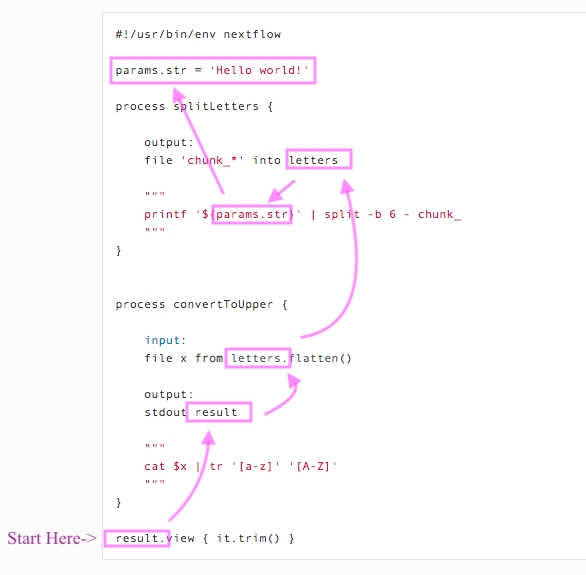

# Workflow tools

**Last Update:** 2020/07/15

**Purpose:** Describe workflow tools in terms of Makefiles, Snakemake, and Nextflow

Probably the earliest workflow tool is Makefiles for compiling large c++ projects. Because compilation can be long and tedious, it was important to keep track of which files had been compiled and needed to be recompiled. [The c++ compilation dependency graphs were put into a Makefile](https://www.tutorialspoint.com/makefile/makefile_dependencies.htm) and listed as rules.

```
rule: dependencies...
    echo "any bash command here, usually a g++ statement"
    
```

In case you're curious, here's a [nice tutorial on makefiles](https://makefiletutorial.com/).

[Snakemake](https://snakemake.readthedocs.io/en/stable/) workflows are python scripts extended to include rules (notice how the rules look like c++ Makefile rules). Snakemake is available on bioconda, pip, and docker.

[Nextflow](https://www.nextflow.io/example1.html) place those rules inside process structures. Nextflow is also supposed to be scalable (parallizable) and containerizes the dependencies.

# Citations

* Köster, J. and Rahmann, S., 2012. [Snakemake—a scalable bioinformatics workflow engine](https://pubmed.ncbi.nlm.nih.gov/22908215/). Bioinformatics, 28(19), pp.2520-2522.
* Di Tommaso, P., Chatzou, M., Floden, E.W., Barja, P.P., Palumbo, E. and Notredame, C., 2017. [Nextflow enables reproducible computational workflows](https://pubmed.ncbi.nlm.nih.gov/28398311/). Nature biotechnology, 35(4), pp.316-319.
* Federico, A., Karagiannis, T., Karri, K., Kishore, D., Koga, Y., Campbell, J. and Monti, S., 2019. [Pipeliner: A Nextflow-based framework for the definition of sequencing data processing pipelines](https://pubmed.ncbi.nlm.nih.gov/31316552/). Frontiers in genetics, 10, p.614.

## NextFlow

Click to expand the following items for more detail.

<details><summary>Install Nextflow on MacOS - <b>DONE</b></summary>

Based on [installation instructions on Nextflow](https://www.nextflow.io/), make sure Java version > 1.8

```
java -version
#> java version "1.8.0_162"
#> Java(TM) SE Runtime Environment (build 1.8.0_162-b12)
#> Java HotSpot(TM) 64-Bit Server VM (build 25.162-b12, mixed mode)
```

Install a local copy of nextflow

```
curl -s https://get.nextflow.io | bash
#> CAPSULE: Downloading dependency org.slf4j:log4j-over-slf4j:jar:1.7.25
#> CAPSULE: Downloading dependency org.multiverse:multiverse-core:jar:0.7.0
#> CAPSULE: Downloading dependency com.fasterxml.jackson.core:jackson-databind:jar:2.6.7.2
#> CAPSULE: Downloading dependency joda-time:joda-time:jar:2.8.1
#> ...
#> CAPSULE: Downloading dependency commons-codec:commons-codec:jar:1.10
#>                                                                         
#>       N E X T F L O W
#>       version 20.04.1 build 5335
#>       created 03-05-2020 19:37 UTC (14:37 CDT)
#>       cite doi:10.1038/nbt.3820
#>       http://nextflow.io
#> 
#> 
#> Nextflow installation completed. Please note:
#> - the executable file `nextflow` has been created in the folder: /Users/jenchang/bin/src
#> - you may complete the installation by moving it to a directory in your $PATH
#>

ls -ltr
#> -rwx--x--x  1 jenchang  staff    15K Jul 15 13:22 nextflow
```

The executable `nextflow` can be called locally or moved to the `/usr/local/bin/` folder to be called from anywhere.

</details>


<details> <summary>Simple demo - <b>DONE</b></summary>

The simple example from [nextflow main page](https://www.nextflow.io/) worked.

```
nextflow run hello
#> N E X T F L O W  ~  version 20.04.1
#> Pulling nextflow-io/hello ...
#> downloaded from https://github.com/nextflow-io/hello.git
#> Launching `nextflow-io/hello` [adoring_yonath] - revision: 96eb04d6a4 [master]
#> executor >  local (4)
#> [f0/2e6b0f] process > sayHello (3) [100%] 4 of 4 ✔
#> Ciao world!
#> 
#> Hola world!
#> 
#> Bonjour world!
#> 
#> Hello world!
```

</details>


<details><summary>Your first script - <b>DONE</b></summary>

Ran the [Tutorial "your first script"](https://www.nextflow.io/docs/latest/getstarted.html#your-first-script). Save the following into a file `tutorial.nf`. Notice how nextflow scripts have the `.nf` extension. Also notice the shebang of the script is not `bash` or `python` but `nextflow`.

```
#!/usr/bin/env nextflow

params.str = 'Hello world!'

process splitLetters {

    output:
    file 'chunk_*' into letters

    """
    printf '${params.str}' | split -b 6 - chunk_
    """
}


process convertToUpper {

    input:
    file x from letters.flatten()

    output:
    stdout result

    """
    cat $x | tr '[a-z]' '[A-Z]'
    """
}

result.view { it.trim() }
```

Running the nf script results in :

```
nextflow run tutorial.nf 
#> N E X T F L O W  ~  version 20.04.1
#> Launching `tutorial.nf` [confident_hilbert] - revision: be42f295f4
#> executor >  local (3)
#> [e7/25735b] process > splitLetters       [100%] 1 of 1 ✔
#> [c5/fe3e83] process > convertToUpper (1) [100%] 2 of 2 ✔
#> WORLD!
#> HELLO
```

It might be a little confusing on how to read this script. Read from **bottom up**, I've annotated arrows for how my eyes move across the script.



Processes are executed up the dependency becaues `results` must be created for the output. 

Regardless, I'll need a better understanding of what `results.view {it.trim()}` is doing... and which data structures are available in the nextflow language. This doesn't look like standard bash.

</details>

> For Nextflow language basics, recommend starting at this [sphinx-generated documentation](https://www.nextflow.io/docs/latest/script.html#script-page)...notice that the language seems to wrap bash scripts in java functions. Honest reaction so far is that nextflow commands seem to be aimed at java programmers. Despite the shebang `#! /usr/bin/env` which usually indicates bash/python/other scripting-style languages, the function names (example: `println` instead of bash's `echo`) are from java. Nextflow feels like trying to "speak bash with a java accent". Not saying it's bad, but still exploring features on if the java-accent is worth it.

<details><summary>Nextflow basics - data structures</summary>

Let's start with a hello world... this thing needs to print, putting it into a process without generating a print statement/file doesn't prove it runs or even makes sense.

Let's make a basic "Hello world" **print** to console in **script01.nf**

```
#! /usr/bin/env nextflow

/* Java-style comments */

println "Hello world!"       /* println() is literally a java function, not a funciton in bash */
```

The **bash** run and output works.

```
nextflow run script01.nf
#> N E X T F L O W  ~  version 20.04.1
#> Launching `script01.nf` [gigantic_koch] - #> revision: 583e6071f6
#> Hello world!
```

Moving on to defining **basic variables** and printing them in **script02.nf**: integers, float/double, booleans, strings

```
#! /usr/bin/env nextflow

/*************************************
 Nextflow variables or primative data structures
 *************************************/
println("\n#== Primitive data structures")
println "x can equal: "

x = 1                      /* Integers */
println x + "\t\t\tIntegers"

x = -3.1499392             /* Floating point values */
println x + "\t\tFloat or double values"

x = false                  /* Booleans */
println String.valueOf(x) + "\t\t\tBooleans"
/* https://www.javatpoint.com/java-boolean-to-string */

x = "Hi"                   /* Strings */
println x + "\t\t\tStrings and characters"

x = new java.util.Date()   /* Literally a java date.... */
println String.valueOf(x) + "\tOr dates from java.util.Date()"
```

Which gives us in **bash**:

```
nextflow run script02.nf
#> N E X T F L O W  ~  version 20.04.1
#> Launching `script02.nf` [desperate_bell] - revision: 283effe268
#> 
#> #== Primitive data structures
#> x can equal: 
#> 1			    Integers
#> -3.1499392	            Float or double values
#> false		    Booleans
#> Hi			    Strings and characters
#> Thu Jul 23 10:56:34 CDT 2020	Or dates from java.util.Date()
```

Nextflow has **grouped data structures** that can have heterogeneous types... as a comparison c++ usually has homogeneous element collections (unless you hack it with smart pointers).

Demonstrate list, map and multi assignment in **script03.nf**:

```
#! /usr/bin/env nextflow

/*************************************
 Grouped data structures: Lists, Maps
 *************************************/
println("\n#== Grouped data structures: Lists, Maps ")
myList = [1776, -1, 33, 99, 0, 928734928763]
println "myList = " + myList
println "myList[0] = " + myList[0] + "\tList index starts at 0"
println "size = " + myList.size()

tiny = ["one", "two"]
myList = [1776, -1, tiny, 99, "a", 928734928763]
println "tiny = " + tiny
println "myList = " + myList + "\tList elements can be of mixed type! Similar to R's list"

myMap = ["gene":"FOX2", "length":100, "genbank":"MX8888"]
println "\nmyMap = " + myMap
myMap["length"] = "ten"
println "myMap = " + myMap

/* Perl-style multiple assignments! : ) */
println "\n Multiple assignments (a, b, c) = [\"one\", 2, \"three\"]"
(a, b, c) = ["one", 2, "three"]
println "a = " + a + "; b = " + b + "; c = " + c
```

Output in bash:

```
nextflow run script03.nf
#> N E X T F L O W  ~  version 20.04.1
#> Launching `script03.nf` [kickass_shirley] - revision: 19bc7c56d2
#>
#> #== Grouped data structures: Lists, Maps
#> myList = [1776, -1, 33, 99, 0, 928734928763]
#> myList[0] = 1776     List index starts at 0
#> size = 6
#> tiny = [one, two]
#> myList = [1776, -1, [one, two], 99, a, 928734928763] List elements can be of mixed type! Similar to R's list
#>
#> myMap = [gene:FOX2, length:100, genbank:MX8888]
#> myMap = [gene:FOX2, length:ten, genbank:MX8888]
#>
#>  Multiple assignments (a, b, c) = ["one", 2, "three"]
#> a = one; b = 2; c = three

```

</details>

<details><summary>Nextflow control structures - functions, closures, processes</summary>

... in progress

</details>

**TODO:**

* Find a nextflow script that uses a container
* See how nextflow determines dependencies
* Does it automatically create parallel processes, or does coder need to provide some config file to recommend how to parallize program.

## Common Nextflow errors

<details><summary>Do not use bash-style comments</summary>

An example bash-style comment (`# this is a bash comment`) error message.

```
nextflow run script02.nf
#> N E X T F L O W  ~  version 20.04.1
#> Launching `script02.nf` [adoring_mcnulty] - revision: b47fa12571
#> Script compilation error
#> - file : /Users/jenchang/Desktop/2020-07-23_Nextflow/nextflow/#> Notebook_Jenchang/code/script02.nf
#> - cause: unexpected char: '#' @ line 4, column 1.
#>   # this is a bash comment
#>   ^
#>
#> 1 error
```

Instead use java-style comments (`/* this is a java-style comment */`).

</details>
